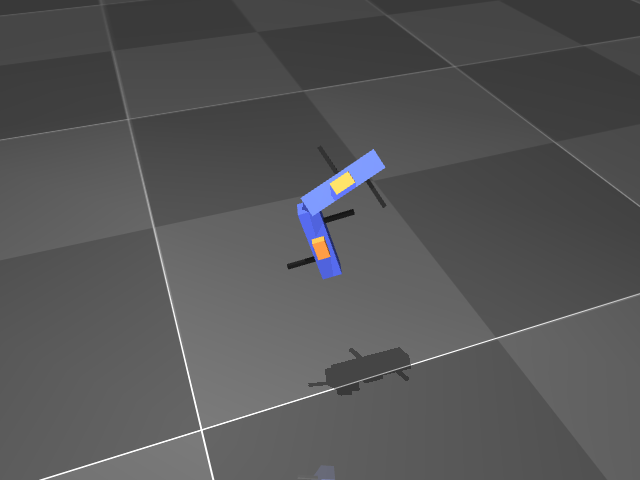

# Gymnasium Environments
Environments that allow to validate inertial motion tracking filters.

## Usage
```python
from ring.utils import register_gym_envs
import gymnasium as gym

env = gym.make("Saddle-v0")
# change seed for different random motions
observation, info = env.reset(seed=1)

for t in range(10_000_000):
    # implement your fancy filter logic that estimates the pose of the system
    # from IMU data (provided as observations)
    predicted_orientation = my_filter(observation)

    # this creates random predictions
    predicted_orientation = env.action_space.sample()
    observation, reward, terminated, truncated, info = env.step(action=predicted_orientation)

    if truncated or terminated:
        break
```

## Available Environments
### `Saddle-v0`

- *Action Space*: Relative Orientation between two segments connected by a 2D joint as a unit Quaternion
    - Range: [-1, 1]
    - Shape: (4,)
    - Dtype: Float32

- *Observation Space*: 6D IMU measurements of two IMUs (one on each segment).
    - Observation Array:
        - Acc IMU1 (3,), m/s**2
        - Gyr IMU1 (3,), rad/s
        - Acc IMU2 (3,), m/s**2
        - Gyr IMU2 (3,), rad/s
    - Range: [-inf, inf]
    - Shape: (12,)
    - Dtype: Float32

- *Reward Function*: Angle error (in radians) between ground truth orientation and predicted orientation (the action)

## Video Recording

```python
from ring.utils import register_gym_envs
import gymnasium as gym
import mediapy

frames = []
for t in range(10_000_000):
    action = env.action_space.sample()
    env.step(action)
    
    if t % 4 == 0:
        frames.append(env.render())

    if truncated or terminated:
        break

mediapy.write_video("video.mp4", frames, fps=25)
```